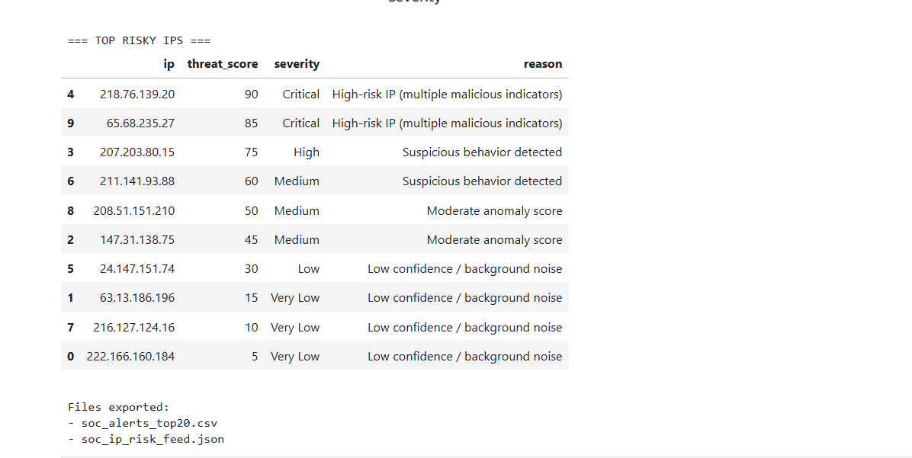
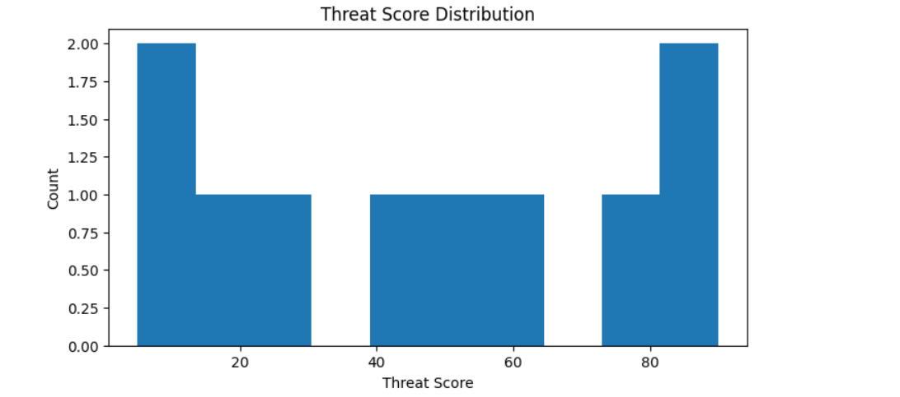

# SOC IP Threat Scoring Dashboard

## 📌 Project Overview

The SOC IP Threat Scoring Dashboard is a cybersecurity analytics project designed to simulate real-world Security Operations Center (SOC) workflows.

This project analyzes log data and integrates threat intelligence feeds to calculate risk scores for IP addresses, enabling faster threat prioritization and decision-making.

---
## Skills Demonstrated

- Security log analysis
- Threat intelligence enrichment
- Risk scoring model development
- Data visualization for security analytics
- Python data analysis (Pandas, Matplotlib)
- SOC threat prioritization workflow

## 🎯 Objectives

- Analyze web server and network logs
- Enrich IP data using threat intelligence feeds
- Assign risk scores to suspicious IP addresses
- Visualize high-risk activity for SOC analysts
- Simulate real-world incident triage workflow

---

## 🛠 Technologies Used

- Python
- Jupyter Notebook
- Log Analysis (Apache / Nginx logs)
- JSON Data Processing
- Threat Intelligence Feeds
- Data Analytics
- Security Analytics Concepts

---

## 📂 Project Structure

SOC-IP-Threat-Scoring-Dashboard/
│
├── dashboards/            # Processed data and scoring outputs
├── data/                  # Sample log files and threat feeds
├── notebooks/             # Log analysis notebooks
├── SOC_IP_Threat_Scoring_Dashboard.ipynb
├── README.md
└── .gitignore

---

## ⚙️ How It Works

1. Import log data
2. Extract IP addresses
3. Cross-reference with threat intelligence feed
4. Apply scoring logic based on severity indicators
5. Generate dashboard-ready output files

---

## 📊 Sample Use Case

This project demonstrates how a SOC analyst can:

- Detect suspicious IP behavior
- Prioritize threats based on risk score
- Reduce alert fatigue
- Improve incident response time

---
---

## 🧠 Skills Demonstrated

- Log parsing and data extraction  
- Threat intelligence enrichment  
- Risk scoring algorithm development  
- SOC workflow simulation  
- Incident prioritization modeling  
- Cybersecurity data analysis using Python  

## 🚀 Future Improvements

- Automate threat feed updates
- Integrate real-time API threat intelligence
- Deploy as a web-based dashboard
- Add MITRE ATT&CK mapping
- Add anomaly detection using ML

---
## Project Output

### Threat Score Distribution

### Risk Score Visualization

### Additional Risk Analysis

---

## 👤 Author

**Reshma Keshireddy** — 
*Cybersecurity & Data Analytics*

LinkedIn: https://linkedin.com/in/reshma-keshireddy-1283b91b6

GitHub: https://github.com/reshmakeshireddy1021-bit

---
---

## 📎 Disclaimer

This project is for educational and portfolio purposes only.

